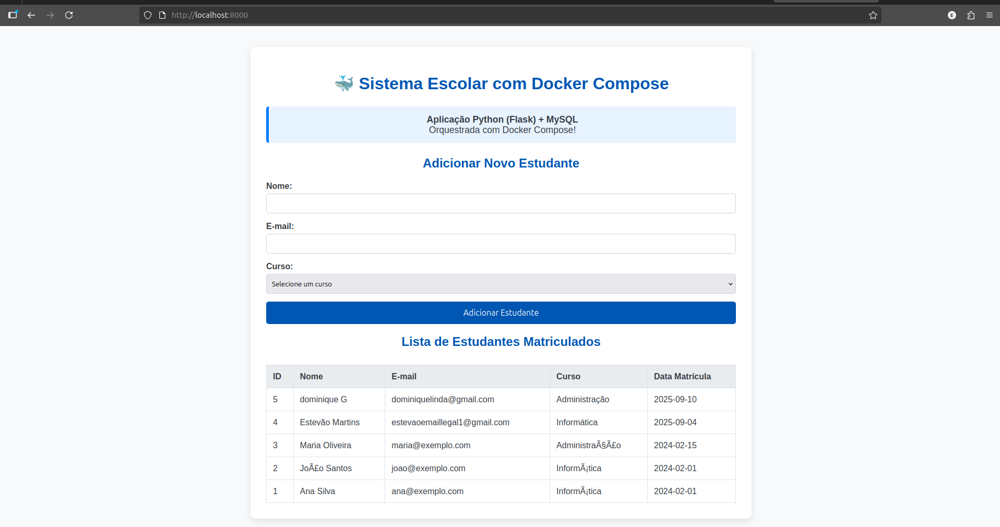

# Tarefa 4 - Docker Compose

## O que é Docker Compose?
Docker Compose é uma ferramenta para definir e executar aplicações Docker multi-container. Com um arquivo YAML, configuramos todos os serviços, redes e volumes da aplicação.

## Serviços Criados

1.  **`app` (Aplicação Web):**
	- Construída a partir de um `Dockerfile`.
	- Roda uma aplicação Python/Flask na porta 5000.
	- Conecta-se ao serviço `db` usando o hostname `db`.

2.  **`db` (Banco de Dados):**
	- Usa a imagem `mysql:8.0`.
	- Persiste os dados usando um volume nomeado `db_data`.
	- Executa o script `criar-tabelas.sql` na primeira inicialização para criar a estrutura do banco e inserir dados de exemplo.

## Vantagens observadas
- **Simplicidade:** Um único comando (`docker compose up`) para subir todo o ambiente.
- **Configuração centralizada:** Tudo está definido no arquivo `docker-compose.yml`.
- **Rede interna:** Os containers se comunicam facilmente usando os nomes dos serviços como hostnames (ex: `app` conecta a `db`).
- **Reprodutibilidade:** Qualquer pessoa com Docker pode clonar o repositório e recriar o mesmo ambiente de desenvolvimento.

## Screenshot

